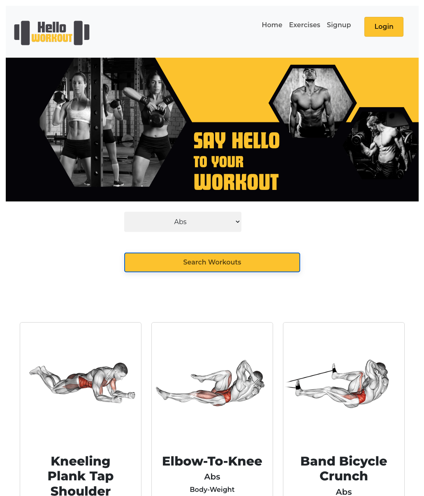

# Fitness-Application

  ## Table of Contents
  - [Description](#description)
  - [Installation](#installation)
  - [Useage](#useage)
  - [Testing](#testing)
  - [Collaborators](#collaborators)
  - [Questions](#questions)

  ## Description 
  Hello Workout full stack, interactive, MERN application. This app was created to connect people with an easy way to stay active, save personalized workouts, and improve movement and overall health. Users will be able to signup or login to the app and browse an extensive number of exercises by muscle group. Users can also save exercises to a queue for future use with the option to add or delete exercises. 

  This application uses React for the front end, GraphQL with a Node.js and Express.js server, MongoDB and the Mongoose ODM for the database, uses queries and mutations for retrieving, adding, updating, and deleting data. Hello Workout also uses [JSON Web Token](https://jwt.io/) for authorization and [dotenv](https://www.npmjs.com/package/dotenv) to protect sensitive API key information.

  ## Installation
  To install this application and view on a localhost, clone repo and install dependencies using `npm install`. Use command `npm run develop` to concurrently run the server and client files.

  ## Useage
  To use Hello Workout visit the deployed application [here](https://enigmatic-ocean-17261.herokuapp.com/).  

  *  Signup or login
  *  Look through the list of exercises availabe by muscle group
  *  Click `Save Exercise` to save the exercise in your saved queue
  *  Workout!

  ## Testing 
  n/a

  ## Collaborators
  Marcus Paccapaniccia | [GitHub](https://github.com/Mpacct)  | [LinkedIn](https://github.com/Mpacct)

  Adrian Walkosz | [GitHub](https://github.com/awalkosz) | [LinkedIn](https://www.linkedin.com/in/adrian-walkosz/)

  Rachel Wildberger | [GitHub](https://github.com/RachelWildberger) | [LinkedIn](https://www.linkedin.com/in/rachelwildbergerdesigner/)

  Nick Rosales | [GitHub](https://github.com/nickrosales) | [LinkedIn](https://github.com/nickrosales)

  ## Questions?
  GitHub: [@Mpacct](https://github.com/Mpacct)

  GitHub: [@awalkosz](https://github.com/awalkosz)

  GitHub: [@RachelWildberger](https://github.com/RachelWildberger)

  GitHub: [@nickrosales](https://github.com/nickrosales)

